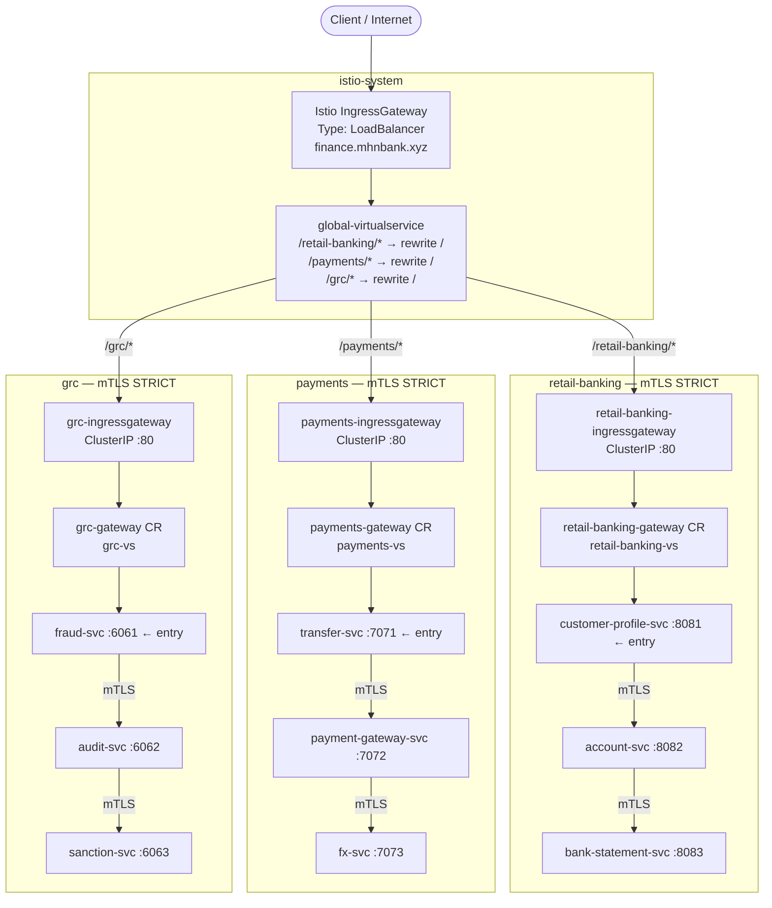

# Distributed API Gateway — Istio + mTLS (Distributed Gateway Pattern)

This project implements a **two-tier distributed API gateway** using **Istio service mesh with mutual TLS (mTLS)** on AWS EKS. A single internet-facing global IngressGateway receives all external traffic and forwards to per-namespace IngressGateways. All service-to-service communication inside the mesh is secured with SPIFFE X.509 certificates issued by istiod, and access is enforced per-service via `AuthorizationPolicy`.

| Parameter | Value |
|---|---|
| Cluster | `istiodc1-cluster` |
| Region | `ap-southeast-1` |
| Cloud | AWS EKS |
| Global Hostname | `finance.mhnbank.xyz` |
| Istio Version | `1.29.2` |
| Istio Control Plane Namespace | `istio-system` |

---

## Architecture


### Two-Tier Gateway Design



---

## Key Design Principles

| Concern | Implementation |
|---|---|
| External entry point | Single `istio-ingressgateway` LoadBalancer in `istio-system` |
| Namespace isolation | Per-namespace `ClusterIP` IngressGateway (`retail-banking`, `payments`, `grc`) |
| Two-tier routing | Global VS → namespace GW → namespace VS → app service |
| Service identity | SPIFFE X.509 SVIDs issued by `istiod` (trust domain: `cluster.local`) |
| mTLS enforcement | `PeerAuthentication` STRICT mesh-wide + per-namespace |
| Client-side mTLS | `DestinationRule` with `tls.mode: ISTIO_MUTUAL` per service |
| Access control (mesh) | `AuthorizationPolicy` per service — namespace GW SA is the only allowed entry-point caller |
| Access control (gateway) | `AuthorizationPolicy` `action: CUSTOM` → OAuth2 Proxy ext_authz → Keycloak OIDC |
| Routing | Istio `Gateway` + `VirtualService` at both global and namespace tiers |
| Observability | Envoy access logs + Kiali service graph dashboard |

---

## File Structure

### Root — Istio control plane & global routing

| File | Purpose |
|---|---|
| `0-istio-operator-global.yaml` | IstioOperator CR — installs Istio control plane + all 4 IngressGateways |
| `0-istio-namespaces-domains.yaml` | Domain namespace declarations with `istio-injection: enabled` |
| `1-istio-gateway-global.yaml` | Istio `Gateway` resource — binds global IngressGateway to `finance.mhnbank.xyz` |
| `2-mtls-peer-authentication.yaml` | `PeerAuthentication` STRICT policies for all namespaces |
| `3-global-virtualservice.yaml` | Global `VirtualService` — routes path prefixes to namespace IngressGateways |
| `4-mtls-destination-rules.yaml` | `DestinationRule` for every service — client-side mTLS mode |
| `5-authorization-policies.yaml` | `AuthorizationPolicy` — RBAC via SPIFFE principal per service |
| `3b-keycloak-virtualservice.yaml` | `VirtualService` — routes `auth.mhnbank.xyz` to Keycloak |
| `6-api-access-control.yaml` | `AuthorizationPolicy` `action: CUSTOM` — delegates auth to OAuth2 Proxy ext_authz |

### Domain apps — per namespace

| File | Purpose |
|---|---|
| `apps/*/namespace.yaml` | Namespace with `istio-injection: enabled` label |
| `apps/*/gateway.yaml` | **Namespace-scoped** `Gateway` CR — binds to the namespace IngressGateway |
| `apps/*/virtualservice.yaml` | Namespace `VirtualService` — bound to namespace gateway, routes to entry service |
| `apps/*/traffic-policy.yaml` | Traffic policy `VirtualService` — retries + timeouts for internal calls |
| `apps/*/<service>.yaml` | Deployment + Service + ServiceAccount |

### Auth services

| File | Purpose |
|---|---|
| `apps/auth/namespace.yaml` | `auth` namespace — sidecar injection **disabled** (ext_authz requires plain HTTP) |
| `apps/auth/redis.yaml` | Redis — OAuth2 Proxy session store |
| `apps/auth/oauth2-proxy-secret.yaml` | Secret — Keycloak client secret + cookie secret (replace placeholders) |
| `apps/auth/oauth2-proxy.yaml` | OAuth2 Proxy — ext_authz backend; validates sessions with Keycloak OIDC |
| `apps/keycloak/namespace.yaml` | `keycloak` namespace — sidecar injection **disabled** |
| `apps/keycloak/realm-import.yaml` | ConfigMap — Keycloak realm JSON (realm `mhnbank`, client `oauth2-proxy-client`) |

### Helm values

| File | Purpose |
|---|---|
| `helm-values/istio-base-values.yaml` | `istio/base` values — Istio CRDs |
| `helm-values/istiod-values.yaml` | `istio/istiod` values — control plane + `meshConfig.extensionProviders` for OAuth2 Proxy |
| `helm-values/istio-ingress-values.yaml` | `istio/gateway` values — global IngressGateway (LoadBalancer) |
| `helm-values/retail-banking-ingress-values.yaml` | `istio/gateway` values — `retail-banking` namespace gateway (ClusterIP) |
| `helm-values/payments-ingress-values.yaml` | `istio/gateway` values — `payments` namespace gateway (ClusterIP) |
| `helm-values/grc-ingress-values.yaml` | `istio/gateway` values — `grc` namespace gateway (ClusterIP) |
| `helm-values/keycloak-values.yaml` | Bitnami Keycloak Helm values — realm import + ClusterIP service |
| `helm-values/kiali-values.yaml` | Kiali observability dashboard values |

---

## Deployment Order

```bash
# Step 0 — Connect to EKS
aws eks update-kubeconfig --name istiodc1-cluster --region ap-southeast-1

# Step 1 — Add Istio Helm repo
helm repo add istio https://istio-release.storage.googleapis.com/charts
helm repo update

# Step 2 — Install Istio base (CRDs)
helm upgrade --install istio-base istio/base -n istio-system --create-namespace \
  -f helm-values/istio-base-values.yaml

# Step 3 — Install istiod (control plane)
helm upgrade --install istiod istio/istiod -n istio-system --wait \
  -f helm-values/istiod-values.yaml

# Step 4 — Create namespaces + enable sidecar injection
kubectl apply -f 0-istio-namespaces-domains.yaml

# Step 5 — Install global IngressGateway (the single internet-facing LoadBalancer)
helm upgrade --install istio-ingressgateway istio/gateway -n istio-system \
  -f helm-values/istio-ingress-values.yaml

# Step 6 — Install per-namespace IngressGateways (internal ClusterIP)
helm upgrade --install retail-banking-ingressgateway istio/gateway -n retail-banking \
  -f helm-values/retail-banking-ingress-values.yaml

helm upgrade --install payments-ingressgateway istio/gateway -n payments \
  -f helm-values/payments-ingress-values.yaml

helm upgrade --install grc-ingressgateway istio/gateway -n grc \
  -f helm-values/grc-ingress-values.yaml

# Step 6b — Deploy Keycloak (Identity Provider)
kubectl apply -f apps/keycloak/namespace.yaml
kubectl apply -f apps/keycloak/realm-import.yaml
helm upgrade --install keycloak oci://registry-1.docker.io/bitnamicharts/keycloak \
  -n keycloak -f helm-values/keycloak-values.yaml --wait

# Step 6c — Deploy Redis + OAuth2 Proxy (ext_authz backend)
# Update placeholder secrets first:
#   apps/auth/oauth2-proxy-secret.yaml — set real client-secret + cookie-secret
kubectl apply -f apps/auth/namespace.yaml
kubectl apply -f apps/auth/redis.yaml
kubectl apply -f apps/auth/oauth2-proxy-secret.yaml
kubectl apply -f apps/auth/oauth2-proxy.yaml

# Step 7 — Deploy Istio global Gateway CR + mTLS policies + VirtualService + access control
kubectl apply -f 1-istio-gateway-global.yaml
kubectl apply -f 2-mtls-peer-authentication.yaml
kubectl apply -f 3-global-virtualservice.yaml
kubectl apply -f 3b-keycloak-virtualservice.yaml
kubectl apply -f 4-mtls-destination-rules.yaml
kubectl apply -f 5-authorization-policies.yaml
kubectl apply -f 6-api-access-control.yaml

# Step 8 — Deploy domain app resources (namespace Gateway CRs, VSes, Deployments)
kubectl apply -f apps/retail-banking/
kubectl apply -f apps/payments/
kubectl apply -f apps/risk-compliance/
```

---

## Traffic Flow

```
finance.mhnbank.xyz
  → Global IngressGateway (LoadBalancer, istio-system)
  → global-virtualservice (path match + URI rewrite to /)
      /retail-banking/* → retail-banking-ingressgateway (ClusterIP, retail-banking ns)
                           → retail-banking-gateway CR + retail-banking-vs
                           → customer-profile-svc:8081  ← entry point
                               ↳ [mTLS] account-svc:8082
                                         ↳ [mTLS] bank-statement-svc:8083

      /payments/*       → payments-ingressgateway (ClusterIP, payments ns)
                           → payments-gateway CR + payments-vs
                           → transfer-svc:7071           ← entry point
                               ↳ [mTLS] payment-gateway-svc:7072
                                         ↳ [mTLS] fx-svc:7073

      /grc/*            → grc-ingressgateway (ClusterIP, grc ns)
                           → grc-gateway CR + grc-vs
                           → fraud-svc:6061              ← entry point
                               ↳ [mTLS] audit-svc:6062
                                         ↳ [mTLS] sanction-svc:6063
```

All intra-mesh arrows are Envoy-to-Envoy mTLS connections authenticated by SPIFFE certificates issued by istiod.

---

## SPIFFE Identity & AuthorizationPolicy

Each service account receives a SPIFFE identity:
```
spiffe://cluster.local/ns/<namespace>/sa/<serviceaccount>
```

**AuthorizationPolicy call chain:**

| Namespace | Caller principal | Target service |
|---|---|---|
| `retail-banking` | `cluster.local/ns/retail-banking/sa/retail-banking-ingressgateway` | `customer-profile-svc` (entry) |
| `retail-banking` | `cluster.local/ns/retail-banking/sa/customer-profile-svc` | `account-svc` |
| `retail-banking` | `cluster.local/ns/retail-banking/sa/account-svc` | `bank-statement-svc` |
| `payments` | `cluster.local/ns/payments/sa/payments-ingressgateway` | `transfer-svc` (entry) |
| `payments` | `cluster.local/ns/payments/sa/transfer-svc` | `payment-gateway-svc` |
| `payments` | `cluster.local/ns/payments/sa/payment-gateway-svc` | `fx-svc` |
| `grc` | `cluster.local/ns/grc/sa/grc-ingressgateway` | `fraud-svc` (entry) |
| `grc` | `cluster.local/ns/grc/sa/fraud-svc` | `audit-svc` |
| `grc` | `cluster.local/ns/grc/sa/audit-svc` | `sanction-svc` |

---

## API Access Control — OAuth2 Proxy + Keycloak + Istio CUSTOM Action

File `6-api-access-control.yaml` adds a browser-grade OAuth2 / OIDC authentication layer at the global IngressGateway using the `CUSTOM` AuthorizationPolicy action. This approach is based on [API Authentication using Istio Ingress Gateway, OAuth2-Proxy and Keycloak](https://medium.com/@senthilrch/api-authentication-using-istio-ingress-gateway-oauth2-proxy-and-keycloak-a980c996c259).

### Components

| Component | Namespace | Role |
|---|---|---|
| **Keycloak** | `keycloak` | Identity Provider — authenticates users, issues OIDC tokens |
| **Redis** | `auth` | OAuth2 Proxy session store (token refresh without re-login) |
| **OAuth2 Proxy** | `auth` | ext_authz backend — validates session cookies, orchestrates Keycloak redirect |
| **`AuthorizationPolicy` CUSTOM** | `istio-system` | Tells Envoy to call OAuth2 Proxy for every `/retail-banking/*`, `/payments/*`, `/grc/*` request |
| **`extensionProviders` in MeshConfig** | `istiod` | Registers OAuth2 Proxy service as `oauth2-proxy` ext_authz backend |

### 21-Step Authentication Flow

```
 1  Browser requests finance.mhnbank.xyz/retail-banking/
 2  IngressGateway Envoy calls OAuth2 Proxy (ext_authz HTTP check) ← CUSTOM AuthorizationPolicy
 3  OAuth2 Proxy creates session state in Redis
 4  OAuth2 Proxy returns 302 → Keycloak /realms/mhnbank/protocol/openid-connect/auth
 5  Browser follows redirect to auth.mhnbank.xyz (Keycloak via IngressGateway)
 6  IngressGateway routes auth.mhnbank.xyz → Keycloak  ← keycloak-vs VirtualService
 7  Keycloak serves the login form
 8  User submits credentials
 9  Keycloak validates credentials, generates authorization code
10  Keycloak redirects browser → finance.mhnbank.xyz/oauth2/callback?code=...
11  Browser follows redirect through IngressGateway
12  IngressGateway routes /oauth2/* → OAuth2 Proxy  ← global-virtualservice
13  OAuth2 Proxy exchanges code for tokens at Keycloak /token endpoint
14  Keycloak returns access token, ID token, refresh token
15  OAuth2 Proxy stores tokens in Redis, sets _mhnbank_oauth2 session cookie
16  OAuth2 Proxy redirects browser back to original URL
17  Browser resends original request with session cookie
18  IngressGateway Envoy calls OAuth2 Proxy again (ext_authz check)
19  OAuth2 Proxy validates cookie against Redis → 200 OK
        + X-Auth-Request-Access-Token, X-Auth-Request-User forwarded upstream
20  Envoy forwards the request into the mesh (mTLS) with auth headers
21  Upstream service responds
```

### Keycloak Configuration

| Setting | Value |
|---|---|
| Realm | `mhnbank` |
| Client ID | `oauth2-proxy-client` |
| Client Secret | `changeme-keycloak-client-secret` (update in `oauth2-proxy-secret.yaml` + `realm-import.yaml`) |
| Redirect URI | `http://finance.mhnbank.xyz/oauth2/callback` |
| Scopes | `openid`, `profile`, `email`, `retail-banking`, `payments`, `grc` |
| Demo user | `testuser` / `testpassword` |

### Headers forwarded to upstream services (after auth)

| Header | Content |
|---|---|
| `Authorization` | `Bearer <access_token>` |
| `X-Auth-Request-Access-Token` | Raw access token |
| `X-Auth-Request-User` | Username from Keycloak |
| `X-Auth-Request-Email` | Email from Keycloak |

### Architecture with API Access Control


### DNS requirements

Create two CNAME records pointing to the same IngressGateway ELB:

```
finance.mhnbank.xyz  CNAME  <istio-ingressgateway ELB hostname>
auth.mhnbank.xyz     CNAME  <istio-ingressgateway ELB hostname>
```

---

## Verification Commands

```bash
# 1. Confirm only 1 external LoadBalancer (global gateway)
kubectl get svc -A --field-selector spec.type=LoadBalancer

# 2. Namespace gateways are ClusterIP
kubectl get svc -n retail-banking retail-banking-ingressgateway
kubectl get svc -n payments payments-ingressgateway
kubectl get svc -n grc grc-ingressgateway

# 3. All pods show 2/2 (app + sidecar)
kubectl get pods -n retail-banking
kubectl get pods -n payments
kubectl get pods -n grc

# 4. PeerAuthentication STRICT everywhere
kubectl get peerauthentication -A

# 5. All Gateway CRs present
kubectl get gateway -A

# 6. All VirtualServices present
kubectl get virtualservice -A

# 7. DestinationRules with ISTIO_MUTUAL
kubectl get destinationrule -A

# 8. AuthorizationPolicies active
kubectl get authorizationpolicy -A

# 9. End-to-end traffic test
INGRESS_HOST=$(kubectl get svc istio-ingressgateway -n istio-system \
  -o jsonpath='{.status.loadBalancer.ingress[0].hostname}')

curl -s -H "Host: finance.mhnbank.xyz" http://${INGRESS_HOST}/retail-banking/
curl -s -H "Host: finance.mhnbank.xyz" http://${INGRESS_HOST}/payments/
curl -s -H "Host: finance.mhnbank.xyz" http://${INGRESS_HOST}/grc/

# 10. Verify mTLS between services
istioctl x describe pod \
  $(kubectl get pod -n retail-banking -l app=account-svc -o jsonpath='{.items[0].metadata.name}') \
  -n retail-banking
```

---

## Troubleshooting

| Symptom | Likely Cause | Fix |
|---|---|---|
| `RBAC: access denied` on entry service | Namespace GW SA name mismatch | Verify actual SA: `kubectl get pod -n retail-banking -l app=retail-banking-ingressgateway -o jsonpath='{.items[0].spec.serviceAccountName}'` and update `5-authorization-policies.yaml` |
| `503` from namespace gateway | Namespace VS not bound to correct gateway selector label | Confirm `apps/*/gateway.yaml` selector matches the gateway pod label (`istio: retail-banking-ingressgateway`) |
| Pod shows `1/1` not `2/2` | Namespace missing `istio-injection=enabled` | Re-apply `0-istio-namespaces-domains.yaml` then restart pods: `kubectl rollout restart deploy -n <ns>` |
| Namespace IngressGateway not found | Helm install skipped or failed | Run the Step 6 `helm install` commands; verify with `kubectl get pods -n <ns> -l app=<ns>-ingressgateway` |
| Global VS sends to wrong host | Copy-paste error in destination host FQDN | Verify `3-global-virtualservice.yaml` destinations end in `.svc.cluster.local` with correct namespace |
| `301 Moved Permanently` with double-slash | Path prefix missing trailing slash | Use `/retail-banking/`, `/payments/`, `/grc/` (with trailing slash) in global VS match |
| IngressGateway has no `EXTERNAL-IP` | AWS ELB still provisioning | Wait 2–3 min; check EC2 → Load Balancers in AWS console |
| Kiali `lookup prometheus … no such host` | Prometheus not installed in `istio-system` | Install Prometheus in `istio-system` and point Kiali URL to `http://prometheus-server.istio-system.svc.cluster.local` |

#### TC-04: Retail Banking path routing

```bash
curl -s -H "Host: finance.mhnbank.xyz" http://${ELB_HOSTNAME}/retail-banking/ | jq .
```

**Expected call chain:** IngressGateway → `customer-profile-svc:8081` → `account-svc:8082` → `bank-statement-svc:8083`

---

#### TC-05: Payments path routing

```bash
curl -s -H "Host: finance.mhnbank.xyz" http://${ELB_HOSTNAME}/payments/ | jq .
```

**Expected call chain:** IngressGateway → `transfer-svc:7071` → `payment-gateway-svc:7072` → `fx-svc:7073`

---

#### TC-06: GRC path routing

```bash
curl -s -H "Host: finance.mhnbank.xyz" http://${ELB_HOSTNAME}/grc/ | jq .
```

**Expected call chain:** IngressGateway → `fraud-svc:6061` → `audit-svc:6062` → `sanction-svc:6063`

---

### mTLS Verification

#### TC-07: mTLS is enforced (STRICT mode)

```bash
# Confirm PeerAuthentication is STRICT in all namespaces
kubectl get peerauthentication -A

# Verify mutual TLS for a specific pod
istioctl x describe pod \
  $(kubectl get pod -n retail-banking -l app=customer-profile-svc -o jsonpath='{.items[0].metadata.name}') \
  -n retail-banking
```

**Expected:** `mTLS: YES` in the istioctl output. All traffic between services uses ISTIO_MUTUAL.

---

### Negative Tests

#### TC-08: Unknown path returns 404

```bash
curl -s -o /dev/null -w "%{http_code}\n" \
  -H "Host: finance.mhnbank.xyz" http://${ELB_HOSTNAME}/unknown/
```

**Expected:** `404`

---

#### TC-09: Wrong Host header returns 404

```bash
curl -s -o /dev/null -w "%{http_code}\n" \
  -H "Host: unknown.mhnbank.xyz" http://${ELB_HOSTNAME}/retail-banking/
```

**Expected:** `404`

---

### SPIFFE Identity Verification

Each microservice has a unique SPIFFE identity derived from its Kubernetes ServiceAccount:

| Service | Namespace | SPIFFE ID |
|---|---|---|
| `istio-ingressgateway` | `istio-system` | `spiffe://cluster.local/ns/istio-system/sa/istio-ingressgateway` |
| `customer-profile-svc` | `retail-banking` | `spiffe://cluster.local/ns/retail-banking/sa/customer-profile-svc` |
| `account-svc` | `retail-banking` | `spiffe://cluster.local/ns/retail-banking/sa/account-svc` |
| `bank-statement-svc` | `retail-banking` | `spiffe://cluster.local/ns/retail-banking/sa/bank-statement-svc` |
| `transfer-svc` | `payments` | `spiffe://cluster.local/ns/payments/sa/transfer-svc` |
| `payment-gateway-svc` | `payments` | `spiffe://cluster.local/ns/payments/sa/payment-gateway-svc` |
| `fx-svc` | `payments` | `spiffe://cluster.local/ns/payments/sa/fx-svc` |
| `fraud-svc` | `grc` | `spiffe://cluster.local/ns/grc/sa/fraud-svc` |
| `audit-svc` | `grc` | `spiffe://cluster.local/ns/grc/sa/audit-svc` |
| `sanction-svc` | `grc` | `spiffe://cluster.local/ns/grc/sa/sanction-svc` |

#### TC-08: Verify SPIFFE certificate (SAN URI) for each service

Extract the X.509 SVID from the Envoy sidecar and confirm the SPIFFE URI matches the expected identity:

```bash
# Helper function — prints the SPIFFE URI from the leaf certificate of any pod
spiffe_id() {
  local pod ns
  pod=$(kubectl get pod -n "$2" -l app="$1" -o jsonpath='{.items[0].metadata.name}')
  ns="$2"
  kubectl exec "$pod" -n "$ns" -c istio-proxy -- \
    openssl s_client -connect localhost:15000 -showcerts </dev/null 2>/dev/null | \
    openssl x509 -noout -text 2>/dev/null | grep -o 'URI:spiffe://[^ ]*'
}
```

**Alternatively, use `istioctl proxy-config secret` (recommended):**

```bash
# Inspect the SVID of a pod — shows the SPIFFE URI in the Subject Alternative Name
verify_spiffe() {
  local app=$1 ns=$2
  POD=$(kubectl get pod -n "$ns" -l app="$app" -o jsonpath='{.items[0].metadata.name}')
  echo "=== $app ($ns) ==="
  istioctl proxy-config secret "$POD" -n "$ns" -o json \
    | jq -r '
        .dynamicActiveSecrets[]
        | select(.name == "default")
        | .secret.tlsCertificate.certificateChain.inlineBytes
      ' \
    | base64 -d \
    | openssl x509 -noout -text \
    | grep "URI:spiffe"
}

# retail-banking
verify_spiffe customer-profile-svc retail-banking
verify_spiffe account-svc          retail-banking
verify_spiffe bank-statement-svc   retail-banking

# payments
verify_spiffe transfer-svc         payments
verify_spiffe payment-gateway-svc  payments
verify_spiffe fx-svc               payments

# grc
verify_spiffe fraud-svc            grc
verify_spiffe audit-svc            grc
verify_spiffe sanction-svc         grc
```

**Expected output per service (example for `customer-profile-svc`):**
```
=== customer-profile-svc (retail-banking) ===
                URI:spiffe://cluster.local/ns/retail-banking/sa/customer-profile-svc
```

---

#### TC-09: Verify SPIFFE identity using `istioctl x describe`

```bash
# Shows peer identity, mTLS status, and applied policies for each pod
for app in customer-profile-svc account-svc bank-statement-svc; do
  POD=$(kubectl get pod -n retail-banking -l app=$app -o jsonpath='{.items[0].metadata.name}')
  echo "=== $app ==="
  istioctl x describe pod "$POD" -n retail-banking | grep -E "SPIFFE|mTLS|Identity|Service Account"
done

for app in transfer-svc payment-gateway-svc fx-svc; do
  POD=$(kubectl get pod -n payments -l app=$app -o jsonpath='{.items[0].metadata.name}')
  echo "=== $app ==="
  istioctl x describe pod "$POD" -n payments | grep -E "SPIFFE|mTLS|Identity|Service Account"
done

for app in fraud-svc audit-svc sanction-svc; do
  POD=$(kubectl get pod -n grc -l app=$app -o jsonpath='{.items[0].metadata.name}')
  echo "=== $app ==="
  istioctl x describe pod "$POD" -n grc | grep -E "SPIFFE|mTLS|Identity|Service Account"
done
```

---

#### TC-10: Verify IngressGateway SPIFFE identity

```bash
IGW_POD=$(kubectl get pod -n istio-system -l app=istio-ingressgateway \
  -o jsonpath='{.items[0].metadata.name}')

istioctl proxy-config secret "$IGW_POD" -n istio-system -o json \
  | jq -r '
      .dynamicActiveSecrets[]
      | select(.name == "default")
      | .secret.tlsCertificate.certificateChain.inlineBytes
    ' \
  | base64 -d \
  | openssl x509 -noout -text \
  | grep "URI:spiffe"
```

**Expected:**
```
URI:spiffe://cluster.local/ns/istio-system/sa/istio-ingressgateway-service-account
```

---

#### TC-11: Verify AuthorizationPolicy enforces SPIFFE-based RBAC

Confirm that each service only accepts connections from its authorised upstream by checking what `AuthorizationPolicy` is applied:

```bash
# List all AuthorizationPolicies and their allowed principals
kubectl get authorizationpolicy -A -o custom-columns=\
'NAMESPACE:.metadata.namespace,NAME:.metadata.name,FROM:.spec.rules[*].from[*].source.principals[*]'
```

**Expected — one policy per service, one principal per policy:**

| Namespace | Policy | Allowed Principal |
|---|---|---|
| `retail-banking` | `allow-customer-profile-svc` | `cluster.local/ns/istio-system/sa/istio-ingressgateway-service-account` |
| `retail-banking` | `allow-account-svc` | `cluster.local/ns/retail-banking/sa/customer-profile-svc` |
| `retail-banking` | `allow-bank-statement-svc` | `cluster.local/ns/retail-banking/sa/account-svc` |
| `payments` | `allow-transfer-svc` | `cluster.local/ns/istio-system/sa/istio-ingressgateway-service-account` |
| `payments` | `allow-payment-gateway-svc` | `cluster.local/ns/payments/sa/transfer-svc` |
| `payments` | `allow-fx-svc` | `cluster.local/ns/payments/sa/payment-gateway-svc` |
| `grc` | `allow-fraud-svc` | `cluster.local/ns/istio-system/sa/istio-ingressgateway-service-account` |
| `grc` | `allow-audit-svc` | `cluster.local/ns/grc/sa/fraud-svc` |
| `grc` | `allow-sanction-svc` | `cluster.local/ns/grc/sa/audit-svc` |

---

### Negative Tests

#### TC-12: Unknown path returns 404

```bash
curl -s -o /dev/null -w "%{http_code}\n" \
  -H "Host: finance.mhnbank.xyz" http://${ELB_HOSTNAME}/unknown/
```

**Expected:** `404`

---

#### TC-13: Wrong Host header returns 404

```bash
curl -s -o /dev/null -w "%{http_code}\n" \
  -H "Host: unknown.mhnbank.xyz" http://${ELB_HOSTNAME}/retail-banking/
```

**Expected:** `404`

---

### Service Topology Reference

```
/retail-banking/ → customer-profile-svc:8081 → account-svc:8082 → bank-statement-svc:8083 (leaf)
/payments/       → transfer-svc:7071          → payment-gateway-svc:7072 → fx-svc:7073    (leaf)
/grc/            → fraud-svc:6061             → audit-svc:6062   → sanction-svc:6063      (leaf)
```
 ## Project Summary: Distributed API Gateway for MHN Bank

  What It Is

  A secure, enterprise-grade API gateway infrastructure built on AWS, designed to protect and route all external traffic into a banking microservices
   platform. It uses Istio service mesh — the industry-standard technology used by Google, Lyft, and major banks — running on a managed Kubernetes
  cluster (AWS EKS).

  ---
  The Problem It Solves

  Modern banking platforms are made up of many internal services (retail banking, payments, risk & compliance). Without a proper gateway
  architecture, you face these risks:
  - Any service could be called directly from the internet
  - Traffic between internal services is unencrypted and unauthenticated
  - No central enforcement of who can call what
  - User authentication is scattered and inconsistent

  ---
  What Was Built
  
  A two-tier distributed gateway with three layers of security:

  Tier 1 — Single Public Entry Point
  - One internet-facing load balancer (finance.mhnbank.xyz) receives all traffic
  - Routes requests to the correct internal domain by URL path:
    - /retail-banking/* → Retail Banking services
    - /payments/* → Payments services
    - /grc/* → Governance, Risk & Compliance services

  Tier 2 — Per-Domain Isolation
  - Each business domain has its own internal gateway (not exposed to the internet)
  - Traffic can only flow through the designated path — no cross-domain shortcuts

  Inside the Mesh — Zero-Trust Service Communication
  - Every service-to-service call is encrypted with mutual TLS (mTLS)
  - Every service has a cryptographic identity (SPIFFE X.509 certificate)
  - A service can only be called by its one authorized upstream — enforced by policy, not convention

  ---
  Authentication & Identity (OAuth2 / Keycloak)
  
  Users are authenticated via Keycloak (an enterprise-grade identity provider):
  1. User visits finance.mhnbank.xyz → redirected to login page at auth.mhnbank.xyz
  2. Logs in with their credentials → Keycloak issues a session token
  3. All subsequent API calls are validated automatically — no re-login required
  4. The authenticated user's identity is passed securely to backend services via HTTP headers

  ---
  
  Infrastructure

  - Cloud: AWS (Singapore region, ap-southeast-1)
  - Platform: AWS EKS (managed Kubernetes)
  - Service Mesh: Istio 1.29.2
  - Identity Provider: Keycloak (Bitnami, self-hosted)
  - Observability: Kiali + Envoy access logs

  ---
  In plain terms: this project ensures that only authenticated users can reach the bank's APIs, all internal traffic is encrypted and verified by
  cryptographic certificates, and no service can be reached unless the call comes from exactly the right upstream — enforced by policy at the
  infrastructure level, not application code.