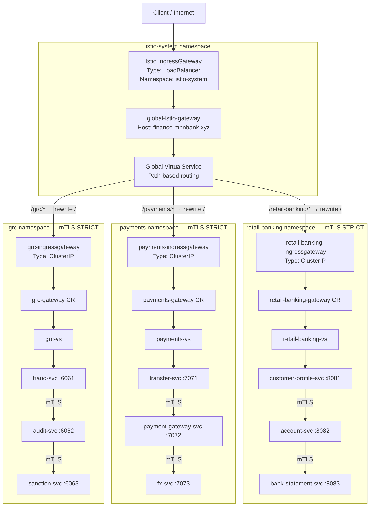

# Distributed API Gateway — Istio + mTLS: Step-by-Step Task

The domain layer has been migrated from Kong Ingress Controllers to **Istio service mesh with mTLS**. The Istio IngressGateway is the single LoadBalancer entry point; all inter-service traffic uses Envoy sidecar mTLS authenticated by SPIFFE X.509 certificates.

| Parameter | Value |
|-----------|-------|
| Cluster Name | `istiodc1-cluster` |
| Region | `ap-southeast-1` |
| Cloud | AWS EKS |
| Global Hostname | `finance.mhnbank.xyz` |
| Istio Control Plane Namespace | `istio-system` |

## Architecture Diagram



Key points:
- **One external LoadBalancer** — Global `istio-ingressgateway` in `istio-system` is the sole internet-facing entry point.
- **Per-namespace IngressGateway** — Each app namespace (`retail-banking`, `payments`, `grc`) has its own `ClusterIP` IngressGateway pod for namespace-level traffic control and isolation.
- **Two-tier Gateway routing** — Global VS routes path prefixes to namespace gateways; namespace VS routes to app entry services.
- **Automatic mTLS** — PeerAuthentication STRICT + DestinationRule ISTIO_MUTUAL on every service.
- **SPIFFE identity** — every service account gets a `spiffe://cluster.local/ns/<ns>/sa/<sa>` cert from istiod.
- **Least-privilege AuthZ** — namespace gateway SA is the only allowed principal to call each namespace's entry service.

---

## Prerequisites

- AWS CLI configured with EKS, EC2, IAM permissions.
- `eksctl`, `kubectl`, and `helm` installed.
- `istioctl` installed and matching the deployed Istio version (1.29.2):

```bash
# Download and install istioctl 1.29.2
curl -sL https://istio.io/downloadIstio | ISTIO_VERSION=1.29.2 sh -

# The binary extracts into the current directory — move it to PATH
sudo mv ./istio-1.29.2/bin/istioctl /usr/local/bin/istioctl
rm -rf ./istio-1.29.2

# Verify
istioctl version --remote=false
# Expected: client version: 1.29.2
```

- Working directory:

```bash
cd /home/mhn/istio-distributed-gateway-local
```

---

## Step 0: Connect to the EKS Cluster

```bash
aws eks update-kubeconfig \
  --name istiodc1-cluster \
  --region ap-southeast-1
```

---

## Step 1: Add Helm Repositories

```bash
helm repo add istio               https://istio-release.storage.googleapis.com/charts
helm repo add prometheus-community https://prometheus-community.github.io/helm-charts
helm repo add kiali               https://kiali.org/helm-charts
helm repo update
```

> Keycloak uses an OCI chart (`oci://registry-1.docker.io/bitnamicharts/keycloak`) — no `repo add` needed; Helm pulls it directly.

---

## Step 2: Install Istio Base (CRDs)

```bash
helm upgrade --install istio-base istio/base \
  -n istio-system --create-namespace \
  --version 1.29.2 \
  -f helm-values/istio-base-values.yaml \
  --wait
```

Verify CRDs:

```bash
kubectl get crd | grep istio
```

Expected CRDs include `virtualservices`, `destinationrules`, `gateways`, `peerauthentications`, `authorizationpolicies`.

---

## Step 3: Install istiod (Control Plane)

`istiod-values.yaml` includes `meshConfig.extensionProviders` registering the OAuth2 Proxy as the `oauth2-proxy` ext_authz backend.

```bash
helm upgrade --install istiod istio/istiod \
  -n istio-system \
  --version 1.29.2 \
  -f helm-values/istiod-values.yaml \
  --wait
```

Verify:

```bash
kubectl rollout status deployment/istiod -n istio-system --timeout=120s
```

Expected: `istiod` pod Running, deployment Available.

---

## Step 4: Create Domain Namespaces with Sidecar Injection

```bash
kubectl apply -f 0-istio-namespaces-domains.yaml
```

Verify label:

```bash
kubectl get ns retail-banking payments grc --show-labels | grep istio-injection
```

Expected: all three namespaces show `istio-injection=enabled`.

---

## Step 5: Install Global IngressGateway (the Single LoadBalancer)

```bash
helm upgrade --install istio-ingressgateway istio/gateway \
  -n istio-system \
  --version 1.29.2 \
  -f helm-values/istio-ingress-values.yaml \
  --wait
```

Verify and capture the ELB hostname (wait up to ~3 min for AWS to provision):

```bash
kubectl get svc -n istio-system istio-ingressgateway

INGRESS_HOST=$(kubectl get svc istio-ingressgateway -n istio-system \
  -o jsonpath='{.status.loadBalancer.ingress[0].hostname}')
echo $INGRESS_HOST
```

Expected: `TYPE=LoadBalancer` with an `EXTERNAL-IP` (AWS ELB hostname).

---

## Step 6: Install Per-Namespace IngressGateways (ClusterIP)

Each domain namespace gets its own ClusterIP IngressGateway for namespace-level isolation.

```bash
helm upgrade --install retail-banking-ingressgateway istio/gateway \
  -n retail-banking \
  --version 1.29.2 \
  -f helm-values/retail-banking-ingress-values.yaml \
  --wait

helm upgrade --install payments-ingressgateway istio/gateway \
  -n payments \
  --version 1.29.2 \
  -f helm-values/payments-ingress-values.yaml \
  --wait

helm upgrade --install grc-ingressgateway istio/gateway \
  -n grc \
  --version 1.29.2 \
  -f helm-values/grc-ingress-values.yaml \
  --wait
```

Verify (all three must be `ClusterIP`, not `LoadBalancer`):

```bash
kubectl get svc retail-banking-ingressgateway -n retail-banking
kubectl get svc payments-ingressgateway       -n payments
kubectl get svc grc-ingressgateway            -n grc
```

---

## Step 6b: Deploy Keycloak — Identity Provider

```bash
kubectl apply -f apps/keycloak/namespace.yaml
kubectl apply -f apps/keycloak/realm-import.yaml
kubectl apply -f apps/keycloak/keycloak.yaml
```

Verify:

```bash
kubectl rollout status deployment/keycloak -n keycloak --timeout=300s

kubectl get pods -n keycloak
# Expected: keycloak-<hash>  Running 1/1

kubectl get svc keycloak -n keycloak
# Expected: TYPE=ClusterIP (accessible via auth.mhnbank.xyz through IngressGateway)
```

**Keycloak is reachable at `http://auth.mhnbank.xyz/realms/mhnbank` via the IngressGateway.**
The realm, client (`oauth2-proxy-client`), scopes, and demo user (`testuser`/`testpassword`) are imported automatically on first startup.

---

## Step 6c: Apply Istio Gateway CR + VirtualServices (Routing First)

> **Important:** Routing must be in place before OAuth2 Proxy starts. OAuth2 Proxy contacts `auth.mhnbank.xyz` at startup for OIDC discovery — Envoy must be able to route that hostname to Keycloak before the OAuth2 Proxy pod initialises.

```bash
# Global Gateway CR — binds finance.mhnbank.xyz + auth.mhnbank.xyz on :80
kubectl apply -f 1-istio-gateway-global.yaml

# Global VirtualService — includes /oauth2/ → oauth2-proxy route
kubectl apply -f 3-global-virtualservice.yaml

# Keycloak VirtualService — auth.mhnbank.xyz → keycloak:80
kubectl apply -f 3b-keycloak-virtualservice.yaml
```

Verify:

```bash
kubectl get gateway -n istio-system global-istio-gateway
kubectl get virtualservice -n istio-system
```

> **DNS prerequisite before Step 6d:**
> - `auth.mhnbank.xyz` must CNAME to the ELB hostname from Step 5
> - `finance.mhnbank.xyz` must CNAME to the ELB hostname from Step 5
>
> If DNS is not yet configured, OAuth2 Proxy will `CrashLoopBackOff`.

> **Secrets to update before Step 6d** (`apps/auth/oauth2-proxy-secret.yaml`):
> - `OAUTH2_PROXY_CLIENT_SECRET` — must match the Keycloak client `oauth2-proxy-client` secret
> - `OAUTH2_PROXY_COOKIE_SECRET` — exactly 32 raw characters, e.g.:
>   ```bash
>   python3 -c "import random,string; print(''.join(random.choices(string.ascii_letters+string.digits+'!@#',k=32)))"
>   ```

---

## Step 6d: Deploy OAuth2 Proxy + Redis — ext_authz Backend

```bash
kubectl apply -f apps/auth/namespace.yaml
kubectl apply -f apps/auth/redis.yaml
kubectl apply -f apps/auth/oauth2-proxy-secret.yaml
kubectl apply -f apps/auth/oauth2-proxy.yaml

# Force-restart so the pod always picks up the current secret value
kubectl rollout restart deployment/oauth2-proxy -n auth
```

Verify:

```bash
kubectl rollout status deployment/redis        -n auth --timeout=60s
kubectl rollout status deployment/oauth2-proxy -n auth --timeout=120s

kubectl get pods -n auth
# Expected:
#   redis-<hash>        Running 1/1
#   oauth2-proxy-<hash> Running 1/1
```

---

## Step 7: Apply mTLS + DestinationRules + AuthorizationPolicies

```bash
# PeerAuthentication STRICT on all namespaces
kubectl apply -f 2-mtls-peer-authentication.yaml

# DestinationRules — client-side ISTIO_MUTUAL for every service
kubectl apply -f 4-mtls-destination-rules.yaml

# AuthorizationPolicies — SPIFFE RBAC per service (9 policies)
kubectl apply -f 5-authorization-policies.yaml

# CUSTOM AuthorizationPolicy — delegates gateway paths to OAuth2 Proxy ext_authz
kubectl apply -f 6-api-access-control.yaml
```

Verify:

```bash
kubectl get peerauthentication -A
# Expected: STRICT in istio-system, retail-banking, payments, grc

kubectl get destinationrule -A
# Expected: 9 DestinationRules, all tls.mode: ISTIO_MUTUAL

kubectl get authorizationpolicy -A
# Expected: 9 service-level + 1 CUSTOM gateway = 10 total

kubectl get virtualservice -A
# Expected: global-virtualservice, keycloak-vs, and namespace-level VSes
```

Expected PeerAuthentication output:

```
NAMESPACE        NAME                         MODE     AGE
istio-system     default-mtls-strict          STRICT   …
retail-banking   retail-banking-mtls-strict   STRICT   …
payments         payments-mtls-strict         STRICT   …
grc              grc-mtls-strict              STRICT   …
```

Verify extensionProvider is registered in MeshConfig:

```bash
kubectl get configmap istio -n istio-system -o jsonpath='{.data.mesh}' | grep -A5 extensionProviders
```

---

## Step 8: Deploy Domain App Resources

> **Important:** Apply namespace files first — Istio needs the `istio-injection` label before pods are scheduled. `kubectl apply -f <dir>` processes files alphabetically so `account.yaml` comes before `namespace.yaml`.

```bash
# Namespaces first (idempotent if already created in Step 4)
kubectl apply -f apps/retail-banking/namespace.yaml
kubectl apply -f apps/payments/namespace.yaml
kubectl apply -f apps/risk-compliance/namespace.yaml

# Deploy all domain resources
kubectl apply -f apps/retail-banking/
kubectl apply -f apps/payments/
kubectl apply -f apps/risk-compliance/
```

Verify all pods have sidecars injected (2/2 containers):

```bash
kubectl get pods -n retail-banking
kubectl get pods -n payments
kubectl get pods -n grc
```

Expected:

```
NAME                           READY   STATUS    RESTARTS   AGE
customer-profile-svc-xxx       2/2     Running   0          …
account-svc-xxx                2/2     Running   0          …
bank-statement-svc-xxx         2/2     Running   0          …
```

`2/2` means the app container + the Envoy sidecar are both running.

---

## Step 9: Install Prometheus

```bash
helm upgrade --install prometheus prometheus-community/prometheus \
  -n istio-system \
  -f helm-values/prometheus-values.yaml \
  --wait
```

Verify:

```bash
kubectl rollout status deployment/prometheus-server -n istio-system --timeout=120s
```

---

## Step 10: Install Kiali

```bash
helm upgrade --install kiali-operator kiali/kiali-operator \
  -n kiali-operator --create-namespace \
  -f helm-values/kiali-values.yaml \
  --wait
```

Verify (Kiali pod is created in `istio-system` by the operator):

```bash
kubectl get pod -n istio-system -l app=kiali

KIALI_HOST=$(kubectl get svc kiali -n istio-system \
  -o jsonpath='{.status.loadBalancer.ingress[0].hostname}')
echo "Kiali URL: http://${KIALI_HOST}:20001/kiali"
```

Navigate to: Graph → select namespaces (`retail-banking` / `payments` / `grc`) → enable "Security" badge. Padlock icons on edges confirm mTLS is active between services.

---

## Step 11: End-to-End Testing

```bash
INGRESS_HOST=$(kubectl get svc istio-ingressgateway -n istio-system \
  -o jsonpath='{.status.loadBalancer.ingress[0].hostname}')

# Unauthenticated request → 302 redirect to Keycloak login
curl -s -o /dev/null -w "%{http_code}" \
  -H "Host: finance.mhnbank.xyz" \
  http://${INGRESS_HOST}/retail-banking/
# Expected: 302 (Location header points to auth.mhnbank.xyz/realms/mhnbank/...)

# OAuth2 Proxy health check via IngressGateway
curl -s -H "Host: finance.mhnbank.xyz" \
  http://${INGRESS_HOST}/oauth2/ping
# Expected: OK

# Full browser flow:
# 1. Open http://finance.mhnbank.xyz/retail-banking/ in a browser
# 2. Keycloak login page appears at http://auth.mhnbank.xyz/...
# 3. Login with testuser / testpassword
# 4. Browser redirected back to /retail-banking/ with authenticated response
```

After authentication, verify each domain path returns `200 OK`:

```bash
# retail-banking → customer-profile-svc → account-svc → bank-statement-svc
curl -H "Host: finance.mhnbank.xyz" http://${INGRESS_HOST}/retail-banking/

# payments → transfer-svc → payment-gateway-svc → fx-svc
curl -H "Host: finance.mhnbank.xyz" http://${INGRESS_HOST}/payments/

# grc → fraud-svc → audit-svc → sanction-svc
curl -H "Host: finance.mhnbank.xyz" http://${INGRESS_HOST}/grc/
```

Expected: all three return `200 OK` JSON:

```
"MHN Bank | retail-banking | account-v1"
"MHN Bank | payments | payment-gateway"
"MHN Bank | risk-compliance | audit"
```

---

## Step 12: Verify mTLS is Active

```bash
# Option 1 — istioctl describe (shows mTLS mode and SPIFFE identity)
istioctl x describe pod \
  $(kubectl get pod -n retail-banking -l app=customer-profile-svc -o jsonpath='{.items[0].metadata.name}') \
  -n retail-banking

# Option 2 — Check Envoy listener config (look for transport_socket with TLS)
istioctl proxy-config listener \
  $(kubectl get pod -n retail-banking -l app=customer-profile-svc -o jsonpath='{.items[0].metadata.name}') \
  -n retail-banking

# Option 3 — Kiali graph (padlock icons on edges)
kubectl get svc kiali -n istio-system -o jsonpath='{.status.loadBalancer.ingress[0].hostname}' && echo ""
# Navigate to: Graph → enable "Security" badge
```

---

## Step 13: Troubleshooting

```bash
# Check istiod logs
kubectl logs -n istio-system deploy/istiod -f

# Check IngressGateway logs
kubectl logs -n istio-system deploy/istio-ingressgateway -f

# Check Envoy sidecar logs for a specific pod
kubectl logs -n retail-banking \
  $(kubectl get pod -n retail-banking -l app=account-svc -o jsonpath='{.items[0].metadata.name}') \
  -c istio-proxy

# Verify PeerAuthentication is enforcing STRICT
kubectl get peerauthentication -A -o yaml | grep -A2 mtls

# Check AuthorizationPolicy denials
kubectl logs -n retail-banking \
  $(kubectl get pod -n retail-banking -l app=bank-statement-svc -o jsonpath='{.items[0].metadata.name}') \
  -c istio-proxy | grep -i rbac

# Check Envoy route config on global IngressGateway
IGW_POD=$(kubectl get pod -n istio-system -l app=istio-ingressgateway -o jsonpath='{.items[0].metadata.name}')
istioctl proxy-config routes $IGW_POD -n istio-system

# Describe VirtualService to check route config
kubectl describe virtualservice global-virtualservice -n istio-system

# Recent cluster events
kubectl get events -A --sort-by=.metadata.creationTimestamp | tail -n 50
```

### Common Issues

| Symptom | Likely Cause | Fix |
|---|---|---|
| `istioctl: command not found` | `istioctl` not installed or not in `PATH` | Run `curl -sL https://istio.io/downloadIstio | ISTIO_VERSION=1.29.2 sh && sudo mv ./istio-1.29.2/bin/istioctl /usr/local/bin/istioctl && rm -rf ./istio-1.29.2` |
| Pod shows `1/1` not `2/2` | Namespace missing `istio-injection=enabled` | Re-apply `0-istio-namespaces-domains.yaml` then restart pods |
| `503 Service Unavailable` | PeerAuthentication STRICT rejects non-mTLS caller | Ensure caller pod has sidecar injected |
| `RBAC: access denied` | AuthorizationPolicy principal mismatch — IngressGateway SA name wrong | Verify with `kubectl get pod -n istio-system -l app=istio-ingressgateway -o jsonpath='{.items[0].spec.serviceAccountName}'`. SA is `istio-ingressgateway`; update entry-point policies in `5-authorization-policies.yaml` to use `cluster.local/ns/istio-system/sa/istio-ingressgateway` |
| `301 Moved Permanently` and double-slash URL (e.g. `//`) | Prefix match missing trailing slash while URI rewrite also adds `/` | In `3-global-virtualservice.yaml`, use `/retail-banking/`, `/payments/`, `/grc/` (with trailing slash) |
| Browser access via ELB returns no matching route | Gateway/VirtualService hosts only include `finance.mhnbank.xyz` | Add the ELB hostname to hosts in both `1-istio-gateway-global.yaml` and `3-global-virtualservice.yaml` |
| IngressGateway has no EXTERNAL-IP | AWS ELB still provisioning | Wait 2–3 min; check EC2 → Load Balancers in AWS console |
| OAuth2 Proxy `CrashLoopBackOff` | DNS not yet pointing to ELB; OIDC discovery fails | Set `auth.mhnbank.xyz` CNAME to ELB hostname before applying Step 6d |
| Bearer JWT returns `302` instead of `200` | `--oidc-issuer-url` uses internal Keycloak URL but JWT `iss` contains public URL — `--skip-jwt-bearer-tokens=true` requires an exact issuer match | Change `--oidc-issuer-url` to `http://auth.mhnbank.xyz/realms/mhnbank` in `apps/auth/oauth2-proxy.yaml` and remove `--insecure-oidc-skip-issuer-verification=true`, then `kubectl rollout restart deployment/oauth2-proxy -n auth` |
| `kubectl logs` on app pod shows no auth headers | Requests never reached the pod — they were 302'd at the IngressGateway | Fix the Bearer JWT 302 issue above first; once requests return 200 the headers will appear in pod logs |
| VirtualService not routing | Gateway selector label mismatch | Verify `istio: ingressgateway` label on Gateway pod |
| `istioctl analyze` shows `IST0109` duplicate VirtualService host warning | Same effective host defined more than once | Keep a single host entry in domain VirtualServices and remove redundant FQDN duplicates |
| Kiali status shows `Failure` / `Pod Status kiali: 0/1` while pod is running | External integration warning (Grafana not configured) | If Grafana is not installed, set `external_services.grafana.enabled: false` in `helm-values/kiali-values.yaml` and `helm upgrade` |
| Kiali error: `lookup prometheus-server.monitoring.svc.cluster.local: no such host` | Wrong Prometheus namespace | Install Prometheus in `istio-system` and set Kiali URL to `http://prometheus-server.istio-system.svc.cluster.local`; restart Kiali |
| Prometheus server pod stays `Pending` | No default StorageClass for dynamic PVC | Upgrade Prometheus with `--set server.persistentVolume.enabled=false` |
| Kiali shows `1 warning found` in app namespaces | Service ports missing Istio-compliant names | Add `name: http` to Service port definitions in grc services |

---

## Test CASE

### Prerequisites

```bash
# Capture the ELB hostname once — used in every test below
INGRESS_HOST=$(kubectl get svc istio-ingressgateway -n istio-system \
  -o jsonpath='{.status.loadBalancer.ingress[0].hostname}')
echo $INGRESS_HOST
```

---

### Accessing Keycloak Web UI

**Option A — via `auth.mhnbank.xyz` (DNS must be configured)**

Open in a browser:
```
http://auth.mhnbank.xyz/admin
```

**Option B — port-forward (no DNS required)**

```bash
kubectl port-forward svc/keycloak -n keycloak 8080:80
```

Then open: `http://localhost:8080/admin`

| Field | Value |
|---|---|
| Username | `admin` |
| Password | `Admin@MHNBank2025` |

After login, switch to the **`mhnbank`** realm (top-left dropdown) to inspect clients, scopes, and users.

---

### Test Case 1 — Unauthenticated Request (expect 302)

Confirms the CUSTOM AuthorizationPolicy and OAuth2 Proxy are active:

```bash
curl -s -o /dev/null -w "%{http_code}\n" \
  -H "Host: finance.mhnbank.xyz" \
  http://${INGRESS_HOST}/retail-banking/
# Expected: 302
```

---

### Test Case 2 — Get a JWT from Keycloak (client_credentials)

Each domain namespace has its own API client. Request a token for the domain you want to call:

```bash
# retail-banking-api
TOKEN=$(curl -s -X POST \
  -H "Host: auth.mhnbank.xyz" \
  http://${INGRESS_HOST}/realms/mhnbank/protocol/openid-connect/token \
  -d "client_id=retail-banking-api" \
  -d "client_secret=retail-banking-api-secret" \
  -d "grant_type=client_credentials" \
  | python3 -c "import sys,json; print(json.load(sys.stdin)['access_token'])")

echo $TOKEN
```

> If DNS is configured, replace `http://${INGRESS_HOST}` with `http://auth.mhnbank.xyz` and drop the `-H "Host:"` header.

---

### Test Case 3 — Decode the JWT (verify the `domain` claim)

```bash
echo $TOKEN | cut -d. -f2 | base64 -d 2>/dev/null | python3 -m json.tool
```

Expected output includes the custom claim injected by the Keycloak protocol mapper:

```json
{
  "iss": "http://auth.mhnbank.xyz/realms/mhnbank",
  "azp": "retail-banking-api",
  "domain": "retail-banking",
  ...
}
```

The `domain` claim is extracted by `7-request-authentication.yaml` into the `x-jwt-domain` request header forwarded to upstream services.

---

### Test Case 4 — Authenticated API Call with Bearer Token (expect 200)

```bash
curl -s \
  -H "Host: finance.mhnbank.xyz" \
  -H "Authorization: Bearer ${TOKEN}" \
  http://${INGRESS_HOST}/retail-banking/
# Expected: 200 OK — "MHN Bank | retail-banking | account-v1"
```

Repeat for the other two domains using their own tokens:

```bash
# payments-api
TOKEN_PAY=$(curl -s -X POST \
  -H "Host: auth.mhnbank.xyz" \
  http://${INGRESS_HOST}/realms/mhnbank/protocol/openid-connect/token \
  -d "client_id=payments-api" \
  -d "client_secret=payments-api-secret" \
  -d "grant_type=client_credentials" \
  | python3 -c "import sys,json; print(json.load(sys.stdin)['access_token'])")

curl -s \
  -H "Host: finance.mhnbank.xyz" \
  -H "Authorization: Bearer ${TOKEN_PAY}" \
  http://${INGRESS_HOST}/payments/
# Expected: 200 OK — "MHN Bank | payments | payment-gateway"

# grc-api
TOKEN_GRC=$(curl -s -X POST \
  -H "Host: auth.mhnbank.xyz" \
  http://${INGRESS_HOST}/realms/mhnbank/protocol/openid-connect/token \
  -d "client_id=grc-api" \
  -d "client_secret=grc-api-secret" \
  -d "grant_type=client_credentials" \
  | python3 -c "import sys,json; print(json.load(sys.stdin)['access_token'])")

curl -s \
  -H "Host: finance.mhnbank.xyz" \
  -H "Authorization: Bearer ${TOKEN_GRC}" \
  http://${INGRESS_HOST}/grc/
# Expected: 200 OK — "MHN Bank | risk-compliance | audit"
```

---

### Test Case 5 — Cross-Client Token Rejection (expect 302 or 403)

Use the `retail-banking-api` token to call `/payments/` — OAuth2 Proxy validates the JWT is genuine but the request should be denied since the token belongs to a different domain client:

```bash
curl -s -o /dev/null -w "%{http_code}\n" \
  -H "Host: finance.mhnbank.xyz" \
  -H "Authorization: Bearer ${TOKEN}" \
  http://${INGRESS_HOST}/payments/
# Expected: 302 or 403
```

---

### Test Case 6 — Browser Flow (testuser login)

Open a browser and navigate to:

```
http://finance.mhnbank.xyz/retail-banking/
```

Expected flow:

| Step | What happens |
|---|---|
| 1 | Browser redirected to `http://auth.mhnbank.xyz/realms/mhnbank/...` (Keycloak login page) |
| 2 | Login with `testuser` / `testpassword` |
| 3 | Keycloak redirects to `http://finance.mhnbank.xyz/oauth2/callback?code=...` |
| 4 | OAuth2 Proxy exchanges the code for a token, stores session in Redis |
| 5 | Cookie `_mhnbank_oauth2` is set; browser redirected to `/retail-banking/` |
| 6 | `200 OK` response — authenticated |

---

### Test Case 7 — Verify Auth Headers Forwarded into the Mesh

Check that the upstream service receives the expected auth headers:

```bash
kubectl logs -n retail-banking \
  $(kubectl get pod -n retail-banking -l app=customer-profile-svc \
    -o jsonpath='{.items[0].metadata.name}') \
  | grep -i "x-auth\|x-jwt\|authorization" | tail -10
```

Expected headers for the **JWT Bearer flow**:
- `x-jwt-domain: retail-banking`
- `x-jwt-client: retail-banking-api`
- `authorization: Bearer <token>` (`forwardOriginalToken: true`)

Expected headers for the **browser/cookie flow**:
- `x-auth-request-user: testuser`
- `x-auth-request-email: testuser@mhnbank.xyz`
- `x-auth-request-access-token: <token>`

---

### Test Case 8 — OAuth2 Proxy Health Check

```bash
curl -s -H "Host: finance.mhnbank.xyz" \
  http://${INGRESS_HOST}/oauth2/ping
# Expected: OK
```