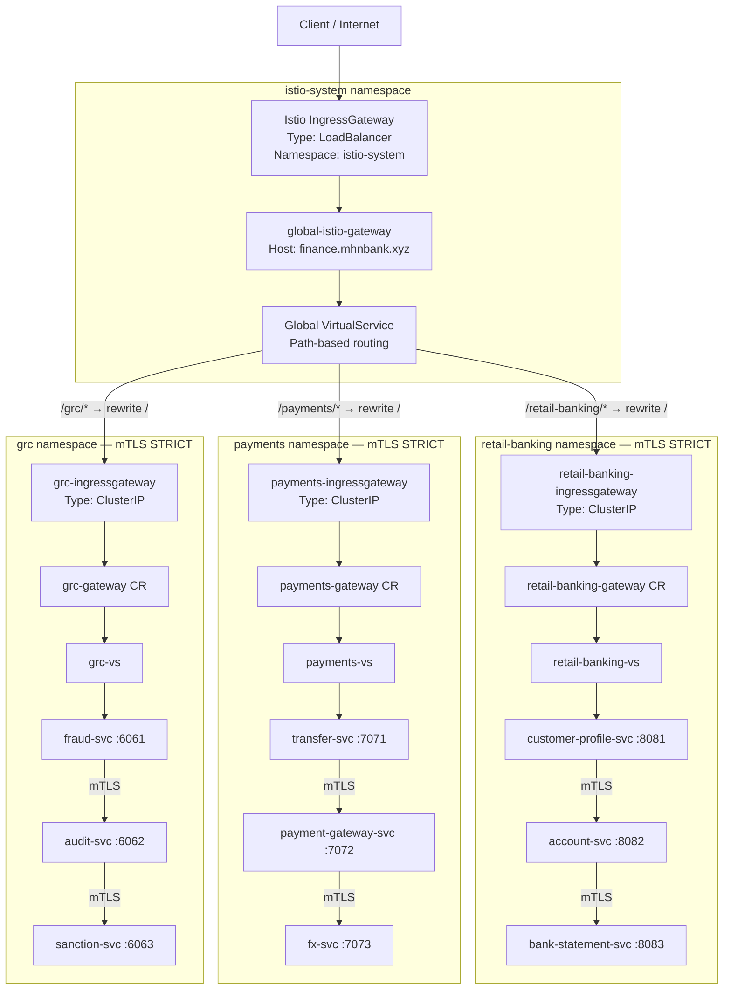

# Distributed API Gateway — Istio + mTLS: Step-by-Step Task

The domain layer has been migrated from Kong Ingress Controllers to **Istio service mesh with mTLS**. The Istio IngressGateway is the single LoadBalancer entry point; all inter-service traffic uses Envoy sidecar mTLS authenticated by SPIFFE X.509 certificates.

| Parameter | Value |
|-----------|-------|
| Cluster Name | `istiodc1-cluster` |
| Region | `ap-southeast-1` |
| Cloud | AWS EKS |
| Global Hostname | `finance.mhnbank.xyz` |
| Istio Control Plane Namespace | `istio-system` |

## Architecture Diagram



Key points:
- **One external LoadBalancer** — Global `istio-ingressgateway` in `istio-system` is the sole internet-facing entry point.
- **Per-namespace IngressGateway** — Each app namespace (`retail-banking`, `payments`, `grc`) has its own `ClusterIP` IngressGateway pod for namespace-level traffic control and isolation.
- **Two-tier Gateway routing** — Global VS routes path prefixes to namespace gateways; namespace VS routes to app entry services.
- **Automatic mTLS** — PeerAuthentication STRICT + DestinationRule ISTIO_MUTUAL on every service.
- **SPIFFE identity** — every service account gets a `spiffe://cluster.local/ns/<ns>/sa/<sa>` cert from istiod.
- **Least-privilege AuthZ** — namespace gateway SA is the only allowed principal to call each namespace's entry service.

---

## Prerequisites

- AWS CLI configured with EKS, EC2, IAM permissions.
- `eksctl`, `kubectl`, and `helm` installed.
- `istioctl` installed and matching the deployed Istio version (1.29.2):

```bash
# Download and install istioctl 1.29.2
curl -sL https://istio.io/downloadIstio | ISTIO_VERSION=1.29.2 sh -

# The binary extracts into the current directory — move it to PATH
sudo mv ./istio-1.29.2/bin/istioctl /usr/local/bin/istioctl
rm -rf ./istio-1.29.2

# Verify
istioctl version --remote=false
# Expected: client version: 1.29.2
```

- Working directory:

```bash
cd /home/mhn/istio-distributed-gateway
```

---

## Step 0: Connect to the EKS Cluster

```bash
aws eks update-kubeconfig \
  --name istiodc1-cluster \
  --region ap-southeast-1
```

Verify:

```bash
kubectl config current-context
kubectl get nodes
```

Expected: all nodes in `Ready` state.

---

## Step 1: Add Istio Helm Repository

```bash
helm repo add istio https://istio-release.storage.googleapis.com/charts
helm repo update
helm search repo istio/
```

---

## Step 2: Install Istio Base (CRDs)

```bash
helm install istio-base istio/base \
  -n istio-system --create-namespace \
  -f helm-values/istio-base-values.yaml
```

Verify CRDs:

```bash
kubectl get crd | grep istio
```

Expected CRDs include `virtualservices`, `destinationrules`, `gateways`, `peerauthentications`, `authorizationpolicies`.

---

## Step 3: Install istiod (Control Plane)

```bash
helm install istiod istio/istiod \
  -n istio-system --wait \
  -f helm-values/istiod-values.yaml
```

Verify:

```bash
kubectl get pods -n istio-system
kubectl rollout status deployment/istiod -n istio-system
```

Expected: `istiod` pod Running, deployment Available.

---

## Step 4: Install Istio IngressGateway (the Single LoadBalancer)

```bash
helm install istio-ingressgateway istio/gateway \
  -n istio-system \
  -f helm-values/istio-ingress-values.yaml
```

Verify:

```bash
kubectl get svc -n istio-system istio-ingressgateway
```

Expected: `TYPE=LoadBalancer`, an `EXTERNAL-IP` (AWS ELB hostname) assigned within ~2 min.

```bash
INGRESS_HOST=$(kubectl get svc istio-ingressgateway -n istio-system \
  -o jsonpath='{.status.loadBalancer.ingress[0].hostname}')
echo $INGRESS_HOST
```

---

## Step 5: Create Domain Namespaces with Sidecar Injection

```bash
kubectl apply -f 0-istio-namespaces-domains.yaml
```

Verify label:

```bash
kubectl get ns retail-banking payments grc --show-labels | grep istio-injection
```

Expected: all three namespaces show `istio-injection=enabled`.

---

## Step 6: Deploy Istio Gateway Resource

```bash
kubectl apply -f 1-istio-gateway-global.yaml
```

Verify:

```bash
kubectl get gateway -n istio-system global-istio-gateway
```

Expected: resource created. It selects `istio: ingressgateway` on `finance.mhnbank.xyz` port 80/443.

---

## Step 7: Apply mTLS PeerAuthentication Policies

```bash
kubectl apply -f 2-mtls-peer-authentication.yaml
```

Verify:

```bash
kubectl get peerauthentication -A
```

Expected output:

```
NAMESPACE        NAME                         MODE     AGE
istio-system     default-mtls-strict          STRICT   …
retail-banking   retail-banking-mtls-strict   STRICT   …
payments         payments-mtls-strict         STRICT   …
grc              grc-mtls-strict              STRICT   …
```

---

## Step 8: Apply Global VirtualService (Path Routing)

```bash
kubectl apply -f 3-global-virtualservice.yaml
```

Verify:

```bash
kubectl get virtualservice -n istio-system global-virtualservice
kubectl describe virtualservice global-virtualservice -n istio-system
```

Expected: VirtualService has 3 HTTP rules routing `/retail-banking`, `/payments`, `/grc`.

---

## Step 9: Apply DestinationRules (Client-side mTLS)

```bash
kubectl apply -f 4-mtls-destination-rules.yaml
```

Verify:

```bash
kubectl get destinationrule -A
```

Expected: 9 DestinationRules — 3 per domain namespace, all with `tls.mode: ISTIO_MUTUAL`.

---

## Step 10: Apply AuthorizationPolicies (RBAC by SPIFFE Identity)

```bash
kubectl apply -f 5-authorization-policies.yaml
```

Verify:

```bash
kubectl get authorizationpolicy -A
```

Expected: 9 AuthorizationPolicies — one per service, restricting callers to the IngressGateway or the correct upstream service account.

---

## Step 10b: Deploy Keycloak — Identity Provider

```bash
# Create keycloak namespace (sidecar injection disabled)
kubectl apply -f apps/keycloak/namespace.yaml

# Apply realm ConfigMap BEFORE the Helm install so keycloakConfigCli can mount it
kubectl apply -f apps/keycloak/realm-import.yaml

# Install Keycloak via Bitnami OCI chart
helm upgrade --install keycloak \
  oci://registry-1.docker.io/bitnamicharts/keycloak \
  -n keycloak \
  -f helm-values/keycloak-values.yaml \
  --wait --timeout=5m
```

Verify:

```bash
kubectl get pods -n keycloak
# Expected: keycloak-0 or keycloak-<hash> Running 1/1

kubectl get svc keycloak -n keycloak
# Expected: TYPE=ClusterIP (accessible via auth.mhnbank.xyz through IngressGateway)
```

**Keycloak is reachable at `http://auth.mhnbank.xyz/realms/mhnbank` via the IngressGateway.**  
The realm, client (`oauth2-proxy-client`), scopes, and demo user (`testuser`/`testpassword`) are imported automatically on first startup by the `keycloakConfigCli` init job.

---

## Step 10c: Deploy Redis + OAuth2 Proxy — ext_authz Backend

> **Before applying:** update the placeholder secrets in `apps/auth/oauth2-proxy-secret.yaml`.

```bash
# Generate a 32-byte cookie secret:
python3 -c "import os,base64; print(base64.b64encode(os.urandom(32)).decode())"

# Edit apps/auth/oauth2-proxy-secret.yaml:
#   OAUTH2_PROXY_CLIENT_SECRET → value from Keycloak client "oauth2-proxy-client"
#   OAUTH2_PROXY_COOKIE_SECRET → base64 output from above

# Also verify apps/auth/oauth2-proxy.yaml ConfigMap:
#   oidc_issuer_url = "http://auth.mhnbank.xyz/realms/mhnbank"
#   redirect_url    = "http://finance.mhnbank.xyz/oauth2/callback"
```

```bash
kubectl apply -f apps/auth/namespace.yaml
kubectl apply -f apps/auth/redis.yaml
kubectl apply -f apps/auth/oauth2-proxy-secret.yaml
kubectl apply -f apps/auth/oauth2-proxy.yaml
```

Verify:

```bash
kubectl get pods -n auth
# Expected:
#   redis-<hash>        Running 1/1
#   oauth2-proxy-<hash> Running 1/1

# OAuth2 Proxy health check
kubectl port-forward -n auth deploy/oauth2-proxy 4180:4180 &
curl -s http://localhost:4180/ping
# Expected: OK
```

---

## Step 10d: Apply API Access Control Resources

```bash
# Update global Gateway to add auth.mhnbank.xyz host binding
kubectl apply -f 1-istio-gateway-global.yaml

# Update global VirtualService — adds /oauth2/ route before catch-all
kubectl apply -f 3-global-virtualservice.yaml

# Add VirtualService for Keycloak on auth.mhnbank.xyz
kubectl apply -f 3b-keycloak-virtualservice.yaml

# Apply CUSTOM AuthorizationPolicy — delegates /retail-banking/*, /payments/*, /grc/*
# to OAuth2 Proxy for every incoming request
kubectl apply -f 6-api-access-control.yaml
```

Verify:

```bash
# 1. CUSTOM AuthorizationPolicy present
kubectl get authorizationpolicy -n istio-system
# Expected: ext-authz-oauth2-proxy  action=CUSTOM  provider=oauth2-proxy

# 2. extensionProvider registered in MeshConfig
kubectl get configmap istio -n istio-system -o jsonpath='{.data.mesh}' | grep -A5 extensionProviders

# 3. Total AuthorizationPolicies: 9 service-level + 1 CUSTOM = 10
kubectl get authorizationpolicy -A --no-headers | wc -l

# 4. /oauth2/ route in global VirtualService
kubectl get virtualservice global-virtualservice -n istio-system \
  -o jsonpath='{.spec.http[*].match[*].uri.prefix}'
# Must include /oauth2/

# 5. keycloak-vs present
kubectl get virtualservice keycloak-vs -n istio-system
```

**End-to-end browser test:**

```bash
INGRESS_HOST=$(kubectl get svc istio-ingressgateway -n istio-system \
  -o jsonpath='{.status.loadBalancer.ingress[0].hostname}')

# Unauthenticated request → 302 redirect to Keycloak login
curl -s -o /dev/null -w "%{http_code}" \
  -H "Host: finance.mhnbank.xyz" \
  http://${INGRESS_HOST}/retail-banking/
# Expected: 302 (Location header points to auth.mhnbank.xyz/realms/mhnbank/...)

# OAuth2 Proxy health check via IngressGateway
curl -s -H "Host: finance.mhnbank.xyz" \
  http://${INGRESS_HOST}/oauth2/ping
# Expected: OK

# Full browser flow:
# 1. Open http://finance.mhnbank.xyz/retail-banking/ in a browser
# 2. Keycloak login page appears at http://auth.mhnbank.xyz/...
# 3. Login with testuser / testpassword
# 4. Browser redirected back to /retail-banking/ with authenticated response
```

> **Production notes:**
> - Replace `changeme-keycloak-client-secret` in both `apps/auth/oauth2-proxy-secret.yaml` and `apps/keycloak/realm-import.yaml` with a strong random secret.
> - Set `cookie_secure = true` in `apps/auth/oauth2-proxy.yaml` ConfigMap when TLS is terminated at the IngressGateway.
> - Replace the H2 embedded database in `helm-values/keycloak-values.yaml` with a PostgreSQL database for production.
> - Remove the demo user from `apps/keycloak/realm-import.yaml` before deploying to production.

---

## Step 11: Deploy Domain App Resources

> **Important:** Apply namespace files first because Istio needs the `istio-injection` label before pods are scheduled. If you `kubectl apply -f <dir>`, files are processed alphabetically — `account.yaml` comes before `namespace.yaml`.

```bash
# Namespaces first (idempotent if already created in Step 5)
kubectl apply -f apps/retail-banking/namespace.yaml
kubectl apply -f apps/payments/namespace.yaml
kubectl apply -f apps/risk-compliance/namespace.yaml

# Deploy all domain resources
kubectl apply -f apps/retail-banking/
kubectl apply -f apps/payments/
kubectl apply -f apps/risk-compliance/
```

Verify all pods have sidecars injected (2/2 containers):

```bash
kubectl get pods -n retail-banking
kubectl get pods -n payments
kubectl get pods -n grc
```

Expected:

```
NAME                           READY   STATUS    RESTARTS   AGE
account-svc-xxx                2/2     Running   0          …
bank-statement-svc-xxx         2/2     Running   0          …
customer-profile-svc-xxx       2/2     Running   0          …
```

`2/2` means the app container + the Envoy sidecar are both running.

---

## Step 12: End-to-End Testing

```bash
INGRESS_HOST=$(kubectl get svc istio-ingressgateway -n istio-system \
  -o jsonpath='{.status.loadBalancer.ingress[0].hostname}')

# retail-banking → account-svc → bank-statement-svc
curl -H "Host: finance.mhnbank.xyz" http://${INGRESS_HOST}/retail-banking/

# payments → payment-gateway-svc → fx-svc
curl -H "Host: finance.mhnbank.xyz" http://${INGRESS_HOST}/payments/

# grc → audit-svc → sanction-svc
curl -H "Host: finance.mhnbank.xyz" http://${INGRESS_HOST}/grc/
```

Expected: all three return `200 OK` JSON with upstream calls showing the chain:
- `account → bank-statement`
- `payment-gateway → fx`
- `audit → sanction`

---

## Step 13: Verify mTLS is Active

```bash
# Option 1 — istioctl describe (shows mTLS mode and SPIFFE identity)
istioctl x describe pod \
  $(kubectl get pod -n retail-banking -l app=account-svc -o jsonpath='{.items[0].metadata.name}') \
  -n retail-banking

# Option 2 — Check Envoy config (look for "transport_socket" with TLS)
istioctl proxy-config listener \
  $(kubectl get pod -n retail-banking -l app=account-svc -o jsonpath='{.items[0].metadata.name}') \
  -n retail-banking

# Option 3 — Kiali graph (shows padlock icons on mTLS edges)
# Kiali is exposed via its own LoadBalancer — no port-forward needed.
# Get the Kiali external URL:
kubectl get svc kiali -n istio-system -o jsonpath='{.status.loadBalancer.ingress[0].hostname}' && echo ""

# Current URL (browser-accessible):
# http://a629d6f3dbc2340fc804dfc5d58ebf98-1856843580.ap-southeast-1.elb.amazonaws.com:20001/kiali

# Navigate to: Graph → select namespaces (retail-banking / payments / grc) → enable "Security" badge
# Padlock icons on edges confirm mTLS is active between services.

# If you need port-forward instead (e.g. after ELB hostname changes):
# kubectl port-forward svc/kiali 20001:20001 -n istio-system
# Then open: http://localhost:20001/kiali
```

---

## Step 14: Verify LoadBalancers

```bash
kubectl get svc -A --field-selector spec.type=LoadBalancer
```

Expected (without Kiali external access):

```
NAMESPACE      NAME                   TYPE           EXTERNAL-IP   PORT(S)
istio-system   istio-ingressgateway   LoadBalancer   <ELB-HOST>    80:…/TCP,443:…/TCP
```

Only one LoadBalancer — the Istio IngressGateway. No domain proxies have external IPs.

If you enabled Kiali with `deployment.service_type: LoadBalancer`, you should see two LoadBalancers:

```
NAMESPACE      NAME                   TYPE           EXTERNAL-IP   PORT(S)
istio-system   istio-ingressgateway   LoadBalancer   <ELB-HOST>    80:.../TCP,443:.../TCP
istio-system   kiali                  LoadBalancer   <ELB-HOST>    20001:.../TCP,9090:.../TCP
```

---

## Step 15: Troubleshooting

```bash
# Check istiod logs
kubectl logs -n istio-system deploy/istiod -f

# Check IngressGateway logs
kubectl logs -n istio-system deploy/istio-ingressgateway -f

# Check Envoy sidecar logs for a specific pod
kubectl logs -n retail-banking \
  $(kubectl get pod -n retail-banking -l app=account-svc -o jsonpath='{.items[0].metadata.name}') \
  -c istio-proxy

# Verify PeerAuthentication is enforcing STRICT
kubectl get peerauthentication -A -o yaml | grep -A2 mtls

# Check AuthorizationPolicy denies (look for RBAC in Envoy access log)
kubectl logs -n retail-banking \
  $(kubectl get pod -n retail-banking -l app=bank-statement-svc -o jsonpath='{.items[0].metadata.name}') \
  -c istio-proxy | grep -i rbac

# Describe VirtualService to check route config
kubectl describe virtualservice global-virtualservice -n istio-system

# Recent cluster events
kubectl get events -A --sort-by=.metadata.creationTimestamp | tail -n 50
```

### Common Issues

| Symptom | Likely Cause | Fix |
|---|---|---|
| `cd /home/mhn/kong-istio-distributed-api-gateway` fails | Old/incorrect directory path | Use `cd /home/mhn/istio-distributed-gateway` |
| `istioctl: command not found` | `istioctl` not installed or not in `PATH` | Install 1.29.2 and move binary from extracted folder to `/usr/local/bin/istioctl`; run `curl -sL https://istio.io/downloadIstio | ISTIO_VERSION=1.29.2 sh && sudo mv ./istio-1.29.2/bin/istioctl /usr/local/bin/istioctl && rm -rf ./istio-1.29.2` |
| Pod shows `1/1` not `2/2` | Namespace missing `istio-injection=enabled` | Re-apply `0-istio-namespaces-domains.yaml` then restart pods |
| `503 Service Unavailable` | PeerAuthentication STRICT rejects non-mTLS caller | Ensure caller pod has sidecar injected |
| `RBAC: access denied` | AuthorizationPolicy principal mismatch — IngressGateway SA name wrong | Verify with `kubectl get pod -n istio-system -l app=istio-ingressgateway -o jsonpath='{.items[0].spec.serviceAccountName}'`. Actual SA is `istio-ingressgateway`; update all three entry-point policies in `5-authorization-policies.yaml` to use `cluster.local/ns/istio-system/sa/istio-ingressgateway` |
| `301 Moved Permanently` and rewritten URL becomes double-slash (for example `//`) | Prefix match missing trailing slash while URI rewrite also adds `/` | In `3-global-virtualservice.yaml`, use `/retail-banking/`, `/payments/`, `/grc/` (with trailing slash) |
| Browser access via ELB returns no matching route | Gateway/VirtualService hosts only include `finance.mhnbank.xyz` | Add the Istio Ingress ELB hostname to hosts in both `1-istio-gateway-global.yaml` and `3-global-virtualservice.yaml` |
| IngressGateway has no EXTERNAL-IP | AWS ELB still provisioning | Wait 2–3 min; check EC2 → Load Balancers in AWS console |
| VirtualService not routing | Gateway selector label mismatch | Verify `istio: ingressgateway` label on Gateway pod |
| `istioctl analyze` shows `IST0109` duplicate VirtualService host warning | Same effective host is defined more than once (for example short host + FQDN for same service) | Keep a single host entry in domain VirtualServices (`customer-profile-svc`, `transfer-svc`, `fraud-svc`) and remove redundant FQDN duplicates |
| Kiali status shows `Failure` / `Pod Status kiali: 0/1` while pod is running | Usually external integration warning (Grafana not configured), not a crashed Kiali pod | Verify pod with `kubectl get pod -n istio-system -l app=kiali`; if Grafana is not installed, set `external_services.grafana.enabled: false` in `helm-values/kiali-values.yaml` and `helm upgrade` |
| Kiali error: `lookup prometheus-server.monitoring.svc.cluster.local: no such host` | Wrong Prometheus namespace and/or Prometheus not installed | Install Prometheus in `istio-system` and set Kiali URL to `http://prometheus-server.istio-system.svc.cluster.local`; then restart Kiali |
| Prometheus server pod stays `Pending` | No default StorageClass for dynamic PVC in cluster | Install/upgrade Prometheus with `--set server.persistentVolume.enabled=false` for this POV cluster |
| Kiali shows `Istio config objects analyzed ... 1 warning found` in app namespaces | Service ports missing Istio-compliant names | Add port names such as `name: http` to Service ports (for example in grc services `6061`, `6062`, `6063`) |
| `git status` fails with `not a git repository` | Project folder not initialized as a git repo | Run `git init -b main`, then `git add .` and `git commit -m "Initial commit"` |

---

## Step 16: Final Verification Summary

```bash
# 1. LoadBalancers present (IngressGateway always; Kiali optional)
kubectl get svc -A --field-selector spec.type=LoadBalancer

# 2. All namespaces have injection enabled
kubectl get ns retail-banking payments grc --show-labels | grep istio-injection

# 3. All pods have sidecars (2/2)
kubectl get pods -n retail-banking -o wide
kubectl get pods -n payments -o wide
kubectl get pods -n grc -o wide

# 4. PeerAuthentication STRICT everywhere
kubectl get peerauthentication -A

# 5. DestinationRules with ISTIO_MUTUAL
kubectl get destinationrule -A

# 6. AuthorizationPolicies active
kubectl get authorizationpolicy -A

# 7. End-to-end traffic
INGRESS_HOST=$(kubectl get svc istio-ingressgateway -n istio-system \
  -o jsonpath='{.status.loadBalancer.ingress[0].hostname}')

curl -s -H "Host: finance.mhnbank.xyz" http://${INGRESS_HOST}/retail-banking/ | jq .body
curl -s -H "Host: finance.mhnbank.xyz" http://${INGRESS_HOST}/payments/ | jq .body
curl -s -H "Host: finance.mhnbank.xyz" http://${INGRESS_HOST}/grc/ | jq .body
```

Expected output:
```
"MHN Bank | retail-banking | account-v1"
"MHN Bank | payments | payment-gateway"
"MHN Bank | risk-compliance | audit"
```
